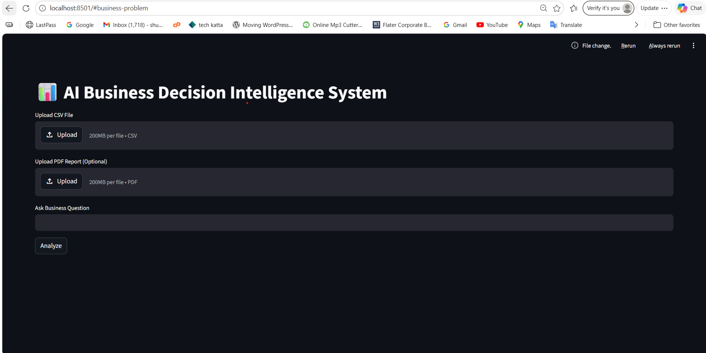
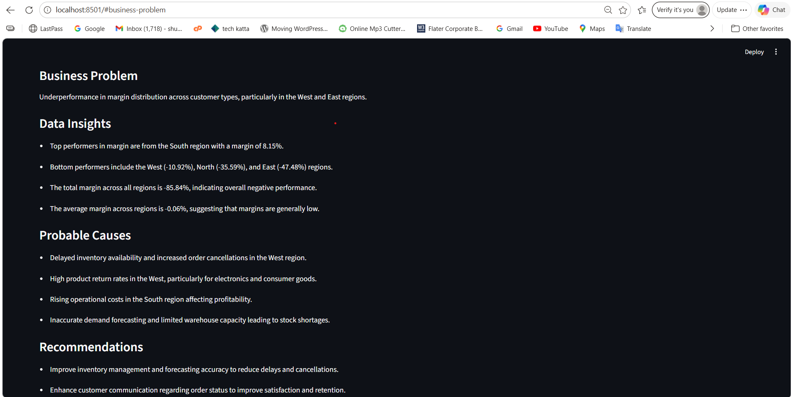
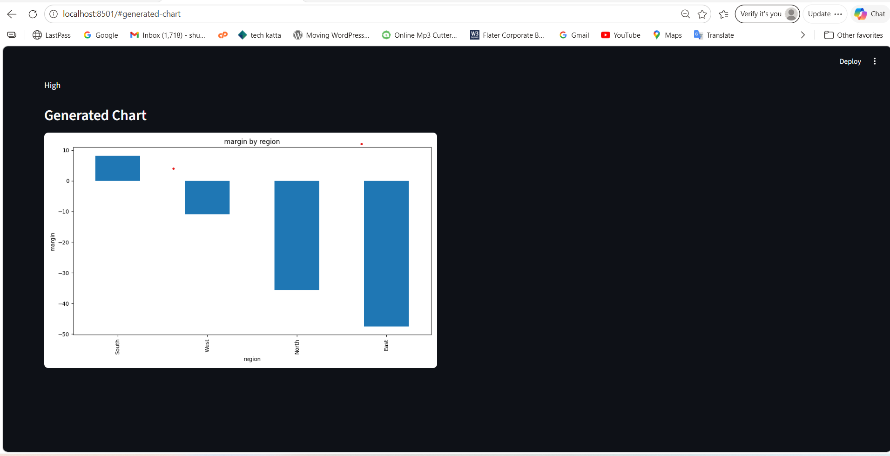

# 📊 AI-Powered Business Decision Intelligence System

An AI-powered Business Intelligence platform built using FastAPI, Streamlit, LangChain, OpenAI, FAISS, and Pandas.

This system combines:

- 📈 Structured business data analysis
- 📄 PDF report understanding using RAG
- 🧠 Semantic schema inference
- 🤖 LLM-powered business reasoning
- 📊 Dynamic chart generation
- 🧮 Derived KPI calculation
- 🎯 Question-aware analytics routing

to help businesses make intelligent data-driven decisions using both structured and unstructured data.

---

# 🚀 Features

# ✅ AI Business Analysis

- Upload CSV datasets
- Ask business questions in natural language
- Generate AI-powered business insights
- Dynamically infer metrics and dimensions

### Example Questions

```text
Why is West region underperforming?

Show profit trends over time.

Which product category has high revenue but low margin?
```

---

# ✅ Question-Aware Analytics Engine

The system intelligently understands:

- requested metrics
- business dimensions
- aggregation intent
- visualization intent

Examples:

| User Question | System Behavior |
|---|---|
| "Show average revenue by region" | Uses mean aggregation |
| "Show profit by category" | Dynamically derives profit |
| "Show monthly sales trends" | Detects datetime + generates line chart |

---

# ✅ Semantic Schema Inference

Automatically detects:

- metric columns
- categorical columns
- datetime columns
- business dimensions

No fixed column assumptions.

The system dynamically adapts to different business datasets.

---

# ✅ Derived Metric Calculation

The platform can dynamically generate KPIs such as:

- Profit
- Margin

using available business metrics like:

```text
profit = revenue - cost
margin = (revenue - cost) / revenue
```

---

# ✅ Dynamic Chart Generation

Automatically selects visualization types based on:
- question intent
- schema understanding
- business context

Supported chart types:

| Scenario | Chart Type |
|---|---|
| Time-series analysis | Line Chart |
| Category comparison | Bar Chart |
| Distribution analysis | Pie Chart |

Examples:
- Revenue trends over time
- Profit by region
- Margin distribution by customer segment

---

# ✅ RAG (Retrieval-Augmented Generation)

Upload:
- PDF reports
- Business notes
- Quarterly reports

The system:
- extracts relevant context
- retrieves useful information
- combines retrieved knowledge with dataframe insights

to generate grounded business reasoning.

---

# ✅ Structured AI Outputs

The system generates:

- Business Problem
- Data Insights
- Probable Causes
- Recommendations
- Evidence
- Business Priority
- Confidence Score

using structured LLM outputs with Pydantic models.

---

# 🏗️ Production-Oriented Architecture

```text
                ┌─────────────────────┐
                │  Streamlit Frontend │
                └──────────┬──────────┘
                           │
                           ▼
                ┌─────────────────────┐
                │   FastAPI Backend   │
                └──────────┬──────────┘
                           │
        ┌──────────────────┼──────────────────┐
        │                                     │
        ▼                                     ▼
┌─────────────────┐                 ┌─────────────────┐
│ Schema Inference│                 │ RAG Pipeline    │
│ & Analytics     │                 │ PDF Retrieval   │
└────────┬────────┘                 └────────┬────────┘
         │                                   │
         ▼                                   ▼
┌─────────────────┐                 ┌─────────────────┐
│ Dynamic Chart   │                 │ Vector Search   │
│ Generation      │                 │ (FAISS)         │
└────────┬────────┘                 └────────┬────────┘
         │                                   │
         └──────────────┬────────────────────┘
                        ▼
              ┌──────────────────┐
              │ OpenAI GPT-4o    │
              └──────────────────┘
                        │
                        ▼
              ┌──────────────────┐
              │ Structured Output│
              └──────────────────┘
```

---

# 🧠 System Intelligence Flow

```text
User Question
      ↓
Semantic Schema Detection
      ↓
Question-Aware Metric Selection
      ↓
Derived KPI Calculation
      ↓
Dynamic Aggregation Selection
      ↓
Dynamic Visualization Routing
      ↓
LLM Business Reasoning
      ↓
Structured AI Output
```

---

# 🛠️ Tech Stack

## Backend
- FastAPI
- LangChain
- OpenAI
- Pandas
- FAISS
- Pydantic

## Frontend
- Streamlit

## Visualization
- Matplotlib

## Deployment
- Render
- Streamlit Cloud

---

# 📂 Project Structure

```text
business-decision-intelligence-system/
│
├── backend/
│   ├── main.py
│   ├── agent.py
│   ├── tools.py
│   ├── charts.py
│   ├── rag.py
│   ├── schema_detector.py
│   ├── models.py
│   ├── prompts.py
│   ├── utils.py
│   ├── requirements.txt
│   └── .env
│
├── frontend/
│   └── app.py
│
├── charts/
├── uploads/
│
├── screenshots/
│
├── README.md
└── .gitignore
```

---

# ⚙️ Installation

## 1️⃣ Clone Repository

```bash
git clone <YOUR_GITHUB_REPO_URL>
```

---

## 2️⃣ Create Virtual Environment

```bash
python -m venv venv
```

---

## 3️⃣ Activate Environment

### Windows

```bash
venv\Scripts\activate
```

### Mac/Linux

```bash
source venv/bin/activate
```

---

## 4️⃣ Install Dependencies

```bash
pip install -r backend/requirements.txt
```

---

## 5️⃣ Add OpenAI API Key

Create `.env` file inside `backend/`

```env
OPENAI_API_KEY=your_openai_api_key
```

---

# ▶️ Run Backend

```bash
cd backend
uvicorn main:app --reload
```

Backend URL:

```text
http://127.0.0.1:8000
```

Swagger Docs:

```text
http://127.0.0.1:8000/docs
```

---

# ▶️ Run Frontend

```bash
cd frontend
streamlit run app.py
```

---

# ☁️ Deployment

## Backend Deployment
- Render

## Frontend Deployment
- Streamlit Cloud

---

# 🌐 Live Demo

## Frontend
https://business-decision-intelligence-system.streamlit.app/

## Backend API
https://business-decision-intelligence-system.onrender.com/analyze

## Swagger Docs
https://business-decision-intelligence-system.onrender.com/docs

---

# 📸 Screenshots

## 🔹 Homepage

```md

```

---

## 🔹 AI Business Analysis

```md

```

---

## 🔹 Dynamic Visualizations

```md

```

---

# 🧠 Example Workflow

## Input

### CSV Dataset
Business operations dataset

### PDF Report
Quarterly business report

### User Question

```text
Show profit trends by region over time.
```

---

# 🤖 System Processing

The system:

✅ detects schema dynamically  
✅ identifies requested business metrics  
✅ derives KPIs when necessary  
✅ retrieves relevant PDF context  
✅ performs semantic business reasoning  
✅ generates dynamic visualizations  
✅ produces structured AI recommendations  

---

# 📤 Example Output

## Business Problem
West region profitability is declining despite stable revenue.

---

## Data Insights
- Revenue remained stable
- Operational costs increased by 22%
- Profit margins dropped significantly

---

## Probable Causes
- Increased logistics expenses
- Higher discount rates
- Inventory inefficiencies

---

## Recommendations
- Optimize shipping operations
- Reduce unnecessary discounting
- Improve regional inventory forecasting

---

## Priority
High

---

## Confidence
High

---

# 🎯 Key Highlights

✅ Question-Aware Analytics  
✅ Semantic Schema Inference  
✅ Derived KPI Calculation  
✅ Dynamic Runtime Charting  
✅ RAG Integration  
✅ Structured AI Outputs  
✅ Production-Oriented Architecture  
✅ Explainable AI Workflow  
✅ FastAPI + Streamlit Integration  
✅ Cloud Deployment  

---

# 🚀 Future Improvements

- Multi-PDF RAG
- SQL database support
- Authentication
- Interactive dashboards
- Docker deployment
- Multi-agent analytics workflows

---

# 👨‍💻 Author

Smruti Lale